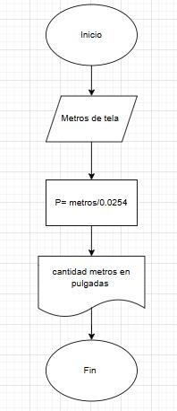

1.
```
inicio
    ingresar "puntos x1, y1"  
    leer x1, x2  
    ingresar "puntos x2, y2"  
    leer x2, y2  
    Calcular D = sqrt((X2 - X1)^2 + (Y2 - Y1)^2)  
    mostrar distancia " la distancia entre los puntos es: ",D  
Fin  
``` 
2.  
```
inicio  
    monstrar "Ingrese la cantidad necesara de tela en metros"  
    leer metros  
    pulgada=(metro/0.0254)  
    mostrar " La cantidad de tela en pulgadas es: ", pulgada  
fin
``` 



3.
```
Inicio
    Mostrar "Ingrese los valores del cateto A"
    Leer A
    Mostrar "Ingrese los valores del cateto B"
    Leer B
    C = sqrt(A^2 + B^2)
    Mostrar "La hipotenusa del triángulo es: ", C
Fin
``` 


4.
 ```
   Inicio
    mostrar "Año de nacimiento y año actual"
    ingresar "Año de nacimiento: "
    Leer Año de nacimiento 
    ingrese "Mes de nacimeinto: " 
    leer Mes de nacimiento 
    ingrese "Dia de nacimiento: "
    leer Dia de naciemiento 

    Ingresar "Año actual"
    leer año actual 
    ingresar "Dia actual: "
    leer dia actual 
    ingresar "Mes actual: "
    leer mes actual 

    edad = año_actual - año_nacimiento
        Si (mes_actual < mes_nacimiento) o (mes_actual = mes_nacimiento y dia_actual < dia_nacimiento) Entonces
        edad = edad - 1
        mostrar "Usted no ha cumplido años 
        Si (mes_actual = mes_nacimiento y dia_actual = dia_nacimiento) Entonces
        Escribir "Feliz Cumpleaños"
    Sino
        Escribir "Ya ha celebrado su cumpleaños este año."
        Escribir "La edad actual de la persona es: ", edad
   fin
``` 
.jpeg

5.
```
Inicio 
    ingrese "Horas trabajadas a la semana: "
    leer horas_trabajadas 
    ingrese "Pago por hora: "
    leer pago_por_hora 
    si horas_trabajadas > 50 
    mostrar "No se permite trabajar más de 50 horas."
    Si horas_trabajadas <= 40 Eentonces
            sueldo = horas_trabajadas * pago_por_hora
    SI horas_trabajadas <= 45 ENTONCES
            sueldo = (40 * pago_por_hora) + ((horas_trabajadas - 40) * (2 * pago_por_hora))

    sino Si horas_trabajadas <= 50 ENTONCES
            sueldo = (40 * pago_por_hora) + (5 * (2 * pago_por_hora)) + ((horas_trabajadas - 45) * (3 * pago_por_hora))
        FIN Si
        escribir "El sueldo semanal es: ", sueldo
    fin
``` 
.jpeg
6. 
```
nicio
    Describir N, cantidad, ceros, menores, mayores
    ceros = 0
    menores = 0
    mayores = 0
 
    ingrese "Ingrese la cantidad de números a evaluar (N): "
    leer N
 
    para x desde 1 hasta N hacer
        ESCRIBIR "Ingrese el número ", x, ": "
        leer cantidad
 
        Si cantidad = 0 ENTONCES
            ceros = ceros + 1
        SI cantidad < 0 ENTONCES
            menores = menores + 1
        SINO
            mayores = mayores + 1
        Fin Si
    fin para 
 
    escribir "Cantidad de ceros: ", ceros
    escribir "Cantidad de números menores a cero: ", menores
    escribir "Cantidad de números mayores a cero: ", mayores
fin
``` 
.jpeg
7.  
```
Inicio
    Definir ahorro_diario como 0
    Definir ahorro_total como 0

    Para día desde 1 hasta 365 hacer
        ahorro_diario = 3^día  // Cálculo del ahorro del día
        ahorro_total = ahorro_total + ahorro_diario 

        Imprimir "Día ", día, ": ahorró ", ahorro_diario, " centavos"
    Fin Para

    Imprimir "Ahorro total en un año: ", ahorro_total, " centavos"
    Imprimir "Ahorro total en un año en pesos: ", ahorro_total / 100, " pesos"
fin
``` 
.jpeg
8.
```
Inicio
    Definir N, precio, descuento, precio_final, total_pagar
    total_pagar = 0

    Escribir "Ingrese la cantidad de artículos a comprar:"
    Leer N

    Para i desde 1 hasta N hacer
        Escribir "Ingrese el precio del artículo ", i, ":"
        Leer precio

        Si precio ≥ 200 Entonces
            descuento = precio * 0.15
        Sino Si precio ≥ 100 Entonces
            descuento = precio * 0.12
        Sino
            descuento = precio * 0.10
        Fin Si

        precio_final = precio - descuento
        total_pagar = total_pagar + precio_final

        Escribir "Artículo ", i, ": Precio = $", precio, ", Descuento = $", descuento, ", Precio Final = $", precio_final
    Fin Para

    Escribir "El total a pagar por todos los artículos es: $", total_pagar

fin
``` 
.jpeg


9.
 ```
    Inicio 
    Definir x, n, termino, factorial, ex como números
    ex = 1   
    factorial = 1   
    Escribir "Ingrese el valor de x:"
    Leer x

    Escribir "Ingrese la cantidad de términos para la aproximación:"
    Leer n

    Para i desde 1 hasta n-1 hacer
        factorial = factorial * i  
        termino = (x^i) / factorial  
        ex = ex + termino  

    Fin Para

    Escribir "La aproximación de e^", x, " con ", n, " términos es: ", ex
    fin
```
 

        Si i mod 2 = 0 Entonces
            sin_x = sin_x + término
        Sino
            sin_x ← sin_x - término
    Fin Para

    Escribir "La aproximación de sin(", x, ") con ", n, " términos es: ", sin_x
    fin 

``` 
Actividad 4
¿Por qué crees que el pseudocódigo es útil antes de escribir un programa en C?

/El pseudocódigo es una herramienta esencial porque simplifica la planificación, detección de errores,
ahorro de tiempo y organización del código.

Toma un pseudocódigo de un ejercicio anterior o escribe tu propio pseudocódigo, similar al mostrado en el ejemplo de arriba.


```
Inicio
    Mostrar "Ingrese la base del triángulo:"
    Leer base
    Mostrar "Ingrese la altura del triángulo:"
    Leer altura

    area = (base * altura) / 2

    Mostrar "El área del triángulo es:", area
Fin
``` 
¿Por qué es importante declarar el tipo de variable (int, float, etc.) antes de usarla en C?

/Declarar el tipo de variable en C es importante porque define el uso de memoria, evita errores.
Cada tipo (int, float, double, etc.) ocupa un espacio específico en la memoria y determina cómo se almacenan y manipulan los datos.


```
Inicio
    Mostrar "Ingrese la cantidad de calificaciones:"
    Leer n

    Si n <= 0 Entonces
        Mostrar "No se puede calcular el promedio."
    Sino
        total = 0
        Para i=1 Hasta n Hacer
            Mostrar "Ingrese la calificación", i, ":"
            Leer calificacion
            total= total + calificacion
        Fin Para

        promedio =total / n
        Mostrar "El promedio de las calificaciones es:", promedio
    Fin Si
Fin
``` 
codigo en c 
``` 
#include <stdio.h>

int main() {
    int n, i;
    float calificacion, total = 0, promedio;

    printf("Ingrese la cantidad de calificaciones: "); // cuántas calificaciones ingresará
    scanf("%d", &n);

    if (n <= 0) {
        printf("No se puede calcular el promedio.\n"); // Verificar si la cantidad es válida
        return 0; // Termina el programa
    }

    for (i = 1; i <= n; i++) {
        printf("Ingrese la calificación %d: ", i); // Leer las calificaciones y sumarlas
        scanf("%f", &calificacion);
        total += calificacion;
    }

    promedio = total / n;
    printf("El promedio de las calificaciones es: %.2f\n", promedio); // Calcular y mostrar el promedio

    return 0;
}
``` 
¿Por qué es importante comentar el código, aunque sea breve y conciso?
Comentar el código es importante porque ayuda a entender el código, facilitando la comprensión para 
otros o para uno en el futuro, explica el "por qué" detrás del código, 
mejora la colaboración haciendo que el código sea más
accesible para equipos.
Los comentarios ahorran tiempo, mejoran la claridad y hacen el código más mantenible. 

Después de este tutorial, ¿qué puntos crees que deberías reforzar para sentirte más seguro al traducir pseudocódigo a C?

/Estructuras de control: Domina if, else, for, while y switch.
