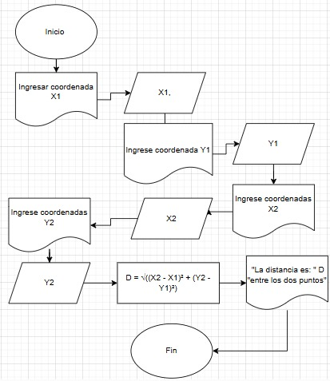
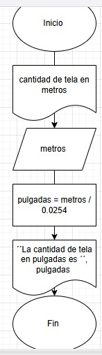
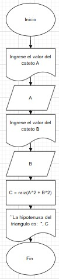

1. 
Este ejercicio calcula la distancia entre dos puntos en el plano cartesiano usando la fórmula del Teorema de Pitágoras. A partir de las coordenadas de entrada (x1, y1) y (x2, y2), se obtiene como salida la distancia D

| Tipo de Variable | Nombre de la Variable | Descripción                            |
|------------------|------------------------|----------------------------------------|
| Entrada          | `x1`                   | Coordenada X del primer punto          |
| Entrada          | `y1`                   | Coordenada Y del primer punto          |
| Entrada          | `x2`                   | Coordenada X del segundo punto         |
| Entrada          | `y2`                   | Coordenada Y del segundo punto         |
| Proceso          | `D`                    | Distancia calculada entre los puntos   |

```
inicio
    mostrar "Ingrese la coordenada x1:"
    leer x1
    mostrar "Ingrese la coordenada y1:"
    leer y1
    mostrar "Ingrese la coordenada x2:"
    leer x2
    mostrar "Ingrese la coordenada y2:"
    leer y2

    D = raiz((x2 - x1)^2 + (y2 - y1)^2)

    mostrar "La distancia es: ",D "entre los puntos "
fin

```



2.  
Se necesita convertir una medida de tela de metros a pulgadas. El algoritmo debe realizar esta conversión utilizando el factor 1 pulgada = 0.0254 metros.

| Tipo   | Variable | Descripción                            |
|-------------|--------------|--------------------------------------------|
| Entrada | metros       | Medida de tela en metros . |
| Salida  | pulgada      | Medida de tela en pulgadas . |
| Constante| 0.0254      | Factor de conversión de metros a pulgadas. |

```
inicio
    mostrar "Ingrese la cantidad necesaria de tela en metros:"
    leer metros
    pulgadas = metros / 0.0254
    mostrar "La cantidad de tela en pulgadas es: ", pulgadas
fin

``` 


3.
El algoritmo pide los valores de los catetos (A y B), aplica la fórmula de Pitágoras y calcula la hipotenusa (C) como la raíz cuadrada de la suma de los cuadrados de los catetos y muestra el resultado.

| Tipo    | Variable | Descripción                                              |
|-------------|--------------|--------------------------------------------------------------|
| Entrada     | A            | Valor del cateto A del triángulo rectángulo                 |
| Entrada     | B            | Valor del cateto B del triángulo rectángulo                 |
| Proceso     | C            | Hipotenusa, calculada como la raíz cuadrada de A² + B²      |
| Salida      | C            | Longitud de la hipotenusa    |

```
Inicio
    Mostrar "Ingrese el valor del cateto A"
    Leer A
    Mostrar "Ingrese el valor del cateto B"
    Leer B
    C = raiz(A^2 + B^2)
    Mostrar "La hipotenusa del triángulo es: ", C
Fin

``` 


4.     
Se debe calcular la edad de una persona a partir de su fecha de nacimiento y verificar si ya cumplió años este año, si aún no, o si hoy es su cumpleaños.

| Tipo    | Variable   | Descripción                                        |
|-------------|----------------|--------------------------------------------------------|
| Entrada | diaNac         | Día de nacimiento                                     |
| Entrada | mesNac         | Mes de nacimiento                                     |
| Entrada | añoNac        | Año de nacimiento                                     |
| Entrada | diaActual      | Día actual                                            |
| Entrada | mesActual      | Mes actual                                            |
| Entrada | añoActual     | Año actual                                            |
| Proceso | edad           | Edad calculada en años                                |
| Salida  | mensaje        | Mensaje indicando si ya cumplió, no ha cumplido o es su cumpleaños |

 ```
   inicio
    mostrar "Ingrese el día de nacimiento:"
    leer diaNac
    mostrar "Ingrese el mes de nacimiento:"
    leer mesNac
    mostrar "Ingrese el año de nacimiento:"
    leer añoNac

    mostrar "Ingrese el día actual:"
    leer diaActual
    mostrar "Ingrese el mes actual:"
    leer mesActual
    mostrar "Ingrese el año actual:"
    leer añoActual

    edad = añoActual - añoNac

    si (mesActual < mesNac) o (mesActual = mesNac y diaActual < diaNac) entonces
        edad = edad - 1
        mostrar "Aún no ha cumplido años este año."
    sino si (mesActual = mesNac y diaActual = diaNac) entonces
        mostrar "¡Hoy es su cumpleaños!"
    sino
        mostrar "Ya cumplió años este año."
    fin si

    mostrar "Su edad actual es: ", edad
fin
``` 
5.
Se debe calcular el sueldo semanal de un trabajador según las horas que trabajó y el pago por hora. Las horas extra entre la 41 y la 45 se pagan al doble, y de la 46 a la 50 al triple. No se permite trabajar más de 50 horas.

| Tipo        | Variable      | Descripción                                      |
|-------------|---------------|--------------------------------------------------|
| Entrada     | horasTrabajadas | Total de horas trabajadas por el empleado       |
| Entrada     | pagoHora      | Monto que se paga por cada hora normal           |
| Proceso     | sueldo        | Sueldo total calculado                          |
| Proceso     | horasNormales | Horas trabajadas hasta la hora 40               |
| Proceso     | horasDobles   | Horas entre 41 y 45                       |
| Proceso     | horasTriples  | Horas entre 46 y 50                       |
| Constante   | 40, 45, 50    | Límites para aplicar las tarifas dobles y triples |

```
inicio
    mostrar "Ingrese la cantidad de horas trabajadas:"
    leer horasTrabajadas

    si horasTrabajadas > 50 entonces
        mostrar "Error: No se permite trabajar más de 50 horas."
    sino
        mostrar "Ingrese el pago por hora:"
        leer pagoHora

        si horasTrabajadas <= 40 entonces
            sueldo = horasTrabajadas * pagoHora
        sino si horasTrabajadas <= 45 entonces
            horasNormales = 40
            horasDobles = horasTrabajadas - 40
            sueldo = (horasNormales * pagoHora) + (horasDobles * pagoHora * 2)
        sino
            horasNormales = 40
            horasDobles = 5
            horasTriples = horasTrabajadas - 45
            sueldo = (horasNormales * pagoHora) + (horasDobles * pagoHora * 2) + (horasTriples * pagoHora * 3)
        fin si

        mostrar "El sueldo semanal es: ", sueldo
    fin si
fin
``` 
6.

Se desea contar, de un total de N números, cuántos son mayores que cero, menores que cero, y cuántos son exactamente cero.

| Tipo      | Variable      | Descripción                                      |
|-----------|----------------|--------------------------------------------------|
| Entrada   | N              | Cantidad total de números a evaluar              |
| Entrada   | num            | Valor actual leído en cada iteración             |
| Proceso   | positivos      | Contador de números mayores a cero               |
| Proceso   | negativos      | Contador de números menores a cero               |
| Proceso   | ceros          | Contador de números iguales a cero               |

```
inicio
    mostrar "Ingrese la cantidad de números a evaluar:"
    leer N

    positivos = 0
    negativos = 0
    ceros = 0

    para i = 1 hasta N hacer
        mostrar "Ingrese un número:"
        leer num

        si num > 0 entonces
            positivos = positivos + 1
        sino si num < 0 entonces
            negativos = negativos + 1
        sino
            ceros = ceros + 1
        fin si
    fin para

    mostrar "Cantidad de números positivos: ", positivos
    mostrar "Cantidad de números negativos: ", negativos
    mostrar "Cantidad de ceros: ", ceros
fin
``` 
7.
Una persona ahorra 3¢ el primero de enero, 9¢ el dos de enero, 27¢ el tres de enero, y así sucesivamente, triplicando el ahorro cada día. Se requiere calcular cuánto ahorrará diariamente y en total durante un año.

| Tipo      | Variable       | Descripción                                        |
|-----------|----------------|----------------------------------------------------|
| Entrada   | dias           | Total de días a considerar (365 para un año)       |
| Entrada   | ahorroDiario   | Ahorro diario en centavos                          |
| Proceso   | ahorroTotal    | Ahorro total acumulado durante el año              |
| Constante | 3              | Ahorro inicial en centavos (3¢ el primer día)       |
| Constante | 365            | Días en un año                                     |

```
inicio
    ahorroTotal = 0
    ahorroDiario = 3  // Ahorro en centavos del primer día

    para dia = 1 hasta 365 hacer
        ahorroTotal = ahorroTotal + ahorroDiario
        mostrar "Día ", dia, ": ", ahorroDiario, " centavos"
        ahorroDiario = ahorroDiario * 3  // Triplicar el ahorro diario
    fin para

    mostrar "Ahorro total en el año: ", ahorroTotal, " centavos"
fin
``` 
8.
Se desea calcular el costo total de N artículos, aplicando descuentos dependiendo de su precio. Si el precio de un artículo es mayor o igual a $200, se aplica un descuento del 15%; si el precio está entre $100 y $199, el descuento es del 12%; y si el precio es menor a $100, el descuento es del 10%. Se debe calcular el costo con descuento de cada artículo y finalmente determinar el total a pagar por todos los artículos adquiridos.

| Tipo      | Variable       | Descripción                                        |
|-----------|----------------|----------------------------------------------------|
| Entrada   | N              | Número de artículos que la persona va a comprar    |
| Entrada   | precio         | Precio de cada artículo                            |
| Proceso   | descuento      | Descuento aplicado al artículo                     |
| Proceso   | precioFinal    | Precio final después de aplicar el descuento       |
| Proceso   | total          | Costo total acumulado de todos los artículos       |

```
Inicio
    Definir N, precio, descuento, precio_final, total_pagar
    total_pagar = 0

    Escribir "Ingrese la cantidad de artículos a comprar:"
    Leer N

    Para i desde 1 hasta N hacer
        Escribir "Ingrese el precio del artículo ", i, ":"
        Leer precio

        Si precio ≥ 200 Entonces
            descuento = precio * 0.15
        Sino Si precio ≥ 100 Entonces
            descuento = precio * 0.12
        Sino
            descuento = precio * 0.10
        Fin Si

        precio_final = precio - descuento
        total_pagar = total_pagar + precio_final

        Escribir "Artículo ", i, ": Precio = $", precio, ", Descuento = $", descuento, ", Precio Final = $", precio_final
    Fin Para

    Escribir "El total a pagar por todos los artículos es: $", total_pagar

fin
``` 
9.
Se desea calcular el valor aproximado de la función exponencial, utilizando su desarrollo en serie de Taylor
$𝑒^𝑥 = 1+\frac x {1!} + \frac {x^2}{2!}+ \frac {x^3}{3!}+ …$**

| **Tipo**   | **Variable** | **Descripción**                                 |
|------------|--------------|-------------------------------------------------|
| Entrada    | `x`          | Exponente al que se desea elevar el número `e` |
| Entrada    | `n`          | Número de términos de la serie a calcular       |
| Proceso    | `i`          | Contador del ciclo para términos de la serie    |
| Proceso    | `termino`    | Valor de cada término de la serie               |
| Proceso    | `factorial`  | Factorial acumulado en cada iteración           |
| Proceso    | `resultado`  | Suma acumulada de los términos de la serie      |
| Salida     | `resultado`  | Valor aproximado de `e^x`                       |

 ```
    Inicio
    Mostrar "Ingrese el valor de x:"
    Leer x
    Mostrar "Ingrese el número de términos a calcular:"
    Leer n

    resultado = 1
    factorial = 1

    Para i = 1 Hasta n Hacer
        factorial = factorial * i
        termino = (x^i) / factorial
        resultado = resultado + termino
    Fin Para

    Mostrar "El valor aproximado de e^x es:", resultado
Fin
```
10.
Realice un algoritmo para obtener el seno de un ángulo y represéntelo mediante pseudocódigo. Utilice la siguiente ecuación: 
$Sen x = x - \frac{x^3}{3!} + \frac{x^5}{5!} - \frac{x^7}{7!} + ...$

| **Tipo**   | **Variable** | **Descripción**                                     |
|------------|--------------|-----------------------------------------------------|
| Entrada    | `x`          | Ángulo en radianes                                  |
| Entrada    | `n`          | Cantidad de términos a considerar en la serie       |
| Proceso    | `i`          | Contador del ciclo                                  |
| Proceso    | `termino`    | Valor del término actual en la serie                |
| Proceso    | `factorial`  | Factorial del exponente impar correspondiente       |
| Proceso    | `potencia`   | Potencia de `x` correspondiente al término actual   |
| Proceso    | `signo`      | Alterna entre 1 y -1 para sumar/restar términos     |
| Proceso    | `resultado`  | Acumulador del valor aproximado de `sen(x)`         |
| Salida     | `resultado`  | Valor aproximado del seno del ángulo ingresado      |

```
 Inicio
    Mostrar "Ingrese el valor del ángulo en radianes:"
    Leer x
    Mostrar "Ingrese la cantidad de términos a calcular:"
    Leer n

    resultado = 0
    signo = 1

    Para i = 0 Hasta n-1 Hacer
        exponente = 2*i + 1
        potencia = x^exponente

        factorial = 1
        Para j = 1 Hasta exponente Hacer
            factorial = factorial * j
        Fin Para

        termino = signo * (potencia / factorial)
        resultado = resultado + termino
        signo = signo * (-1)
    Fin Para

    Mostrar "El valor aproximado de sen(x) es:", resultado
Fin
``` 
Actividad 4
¿Por qué crees que el pseudocódigo es útil antes de escribir un programa en C?

/El pseudocódigo es una herramienta esencial porque simplifica la planificación, detección de errores,
ahorro de tiempo y organización del código.

Toma un pseudocódigo de un ejercicio anterior o escribe tu propio pseudocódigo, similar al mostrado en el ejemplo de arriba.


```
Inicio
    Mostrar "Ingrese la base del triángulo:"
    Leer base
    Mostrar "Ingrese la altura del triángulo:"
    Leer altura

    area = (base * altura) / 2

    Mostrar "El área del triángulo es:", area
Fin
``` 
¿Por qué es importante declarar el tipo de variable (int, float, etc.) antes de usarla en C?

/Declarar el tipo de variable en C es importante porque define el uso de memoria, evita errores.
Cada tipo (int, float, double, etc.) ocupa un espacio específico en la memoria y determina cómo se almacenan y manipulan los datos.


```
Inicio
    Mostrar "Ingrese la cantidad de calificaciones:"
    Leer n

    Si n <= 0 Entonces
        Mostrar "No se puede calcular el promedio."
    Sino
        total = 0
        Para i=1 Hasta n Hacer
            Mostrar "Ingrese la calificación", i, ":"
            Leer calificacion
            total= total + calificacion
        Fin Para

        promedio =total / n
        Mostrar "El promedio de las calificaciones es:", promedio
    Fin Si
Fin
``` 
codigo en c 
``` 
#include <stdio.h>

int main() {
    int n, i;
    float calificacion, total = 0, promedio;

    printf("Ingrese la cantidad de calificaciones: "); // cuántas calificaciones ingresará
    scanf("%d", &n);

    if (n <= 0) {
        printf("No se puede calcular el promedio.\n"); // Verificar si la cantidad es válida
        return 0; // Termina el programa
    }

    for (i = 1; i <= n; i++) {
        printf("Ingrese la calificación %d: ", i); // Leer las calificaciones y sumarlas
        scanf("%f", &calificacion);
        total += calificacion;
    }

    promedio = total / n;
    printf("El promedio de las calificaciones es: %.2f\n", promedio); // Calcular y mostrar el promedio

    return 0;
}
``` 
¿Por qué es importante comentar el código, aunque sea breve y conciso?
Comentar el código es importante porque ayuda a entender el código, facilitando la comprensión para 
otros o para uno en el futuro, explica el "por qué" detrás del código, 
mejora la colaboración haciendo que el código sea más
accesible para equipos.
Los comentarios ahorran tiempo, mejoran la claridad y hacen el código más mantenible. 

Después de este tutorial, ¿qué puntos crees que deberías reforzar para sentirte más seguro al traducir pseudocódigo a C?

/Estructuras de control: Domina if, else, for, while y switch.
